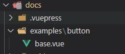
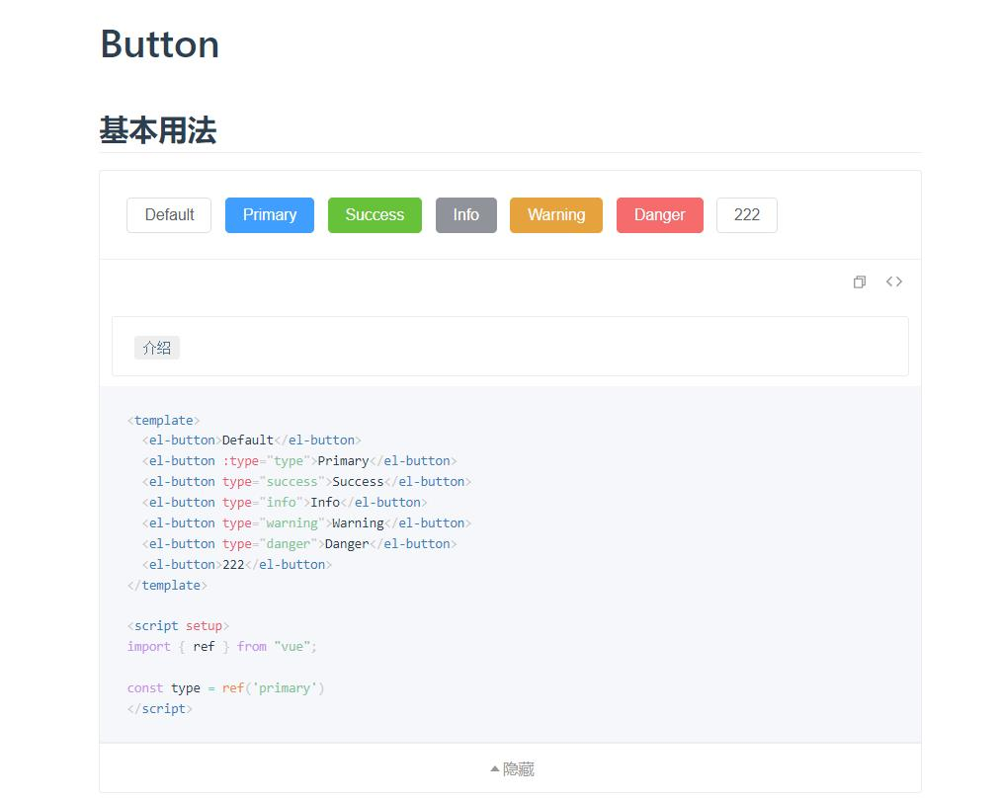

# 描述

一款用于vuepress2.x生成 `演示和预览代码` 的插件,方便你在编写文档的时候增加  `Vue组件示例`

支持Vue3

## 注意事项(必读)

1.使用之前请先安装并了解Vuepress[( 点我查看 )](https://v2.vuepress.vuejs.org/zh/)

2.建议安装Vuepress `^2.0.0-beta.49` 以上版本

3.必须传入`path`参数,值为`__dirname`即可 , ( 下方会介绍 )

4.必须为`dir`参数 创建其对应值的文件夹,否则读取不到文件,会发出警告 ( 下方会介绍 )

## 安装

```bash
  npm i vuepress-plugin-example-block
```

## API 参考

| 参数 | 类型     | 是否必填       | 描述                |
| :-------- | :------- | :------- | :------------------------- |
| `path` | `string` | **true** |设置为:__dirname,参照上方使用方法|
| `dir` | `string` | **false** |vue组件示例目录,默认`examples` |

## 使用方法

#### 1.配置插件

```javascript
// docs/.vuepress/config.js
const exampleDemo = require("vuepress-plugin-example-block");
module.exports = {
    ...
    plugins: [
        exampleDemo({
            path: __dirname,  //必填
            dir:'../examples' //可选,指定组件文件路径,默认'../examples'
        })
    ]
    ...
}
```

#### 2.创建`examples`文件夹,并创建button/base.vue组件

`注意事项(必读) 提示[4]`



`base.vue代码`

此处使用的是element-plus组件示例
如何在vuepress引入element-plus,请查看vuepress客户端配置[( 点我查看 )](https://v2.vuepress.vuejs.org/zh/advanced/cookbook/usage-of-client-config.html#enhance)

```html
<template>
  <el-button>Default</el-button>
  <el-button :type="type">Primary</el-button>
  <el-button type="success">Success</el-button>
  <el-button type="info">Info</el-button>
  <el-button type="warning">Warning</el-button>
  <el-button type="danger">Danger</el-button>
  <el-button>example</el-button>
</template>

<script setup>
import { ref } from "vue";

const type = ref('primary')
</script>
```

#### 3.使用组件组件示例

在你的vuepress任意 md 页面 文件中都可使用

**语法**

```
::: demo `介绍`
button/base
:::
```

**示例**

```md
# Button

## 基本用法

::: demo `介绍`
button/base
:::

```

## 效果预览



## API 参考

| 参数 | 类型     | 是否必填       | 描述                |
| :-------- | :------- | :------- | :------------------------- |
| `path` | `string` | **true** |设置为:__dirname,参照上方使用方法|
| `dir` | `string` | **false** |vue组件示例目录,默认`examples` |
